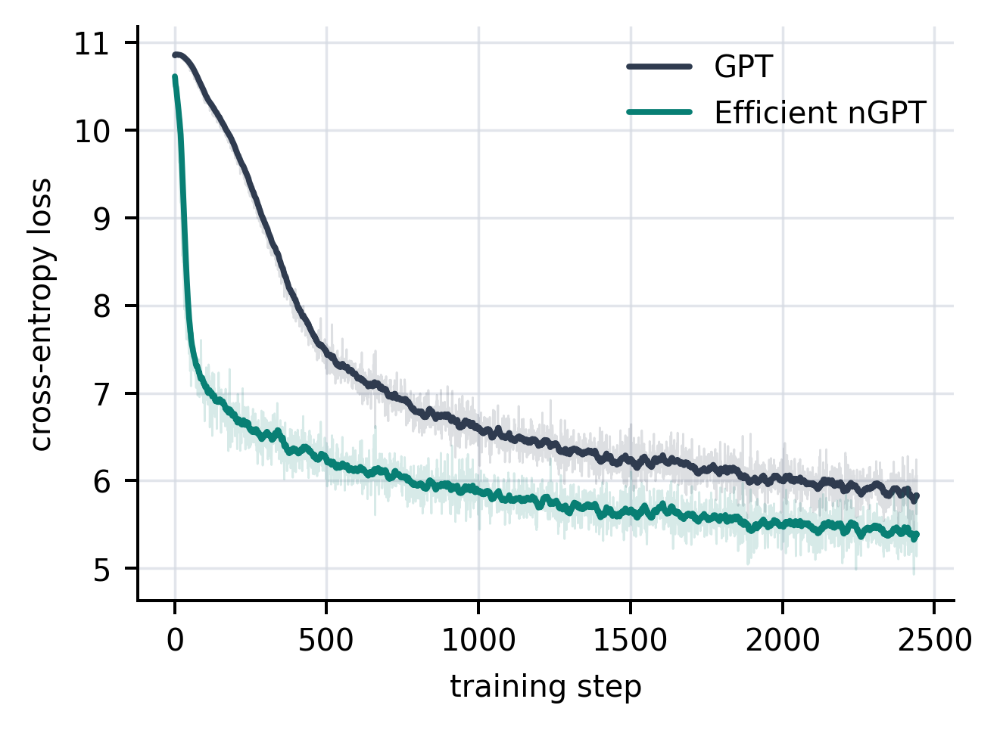
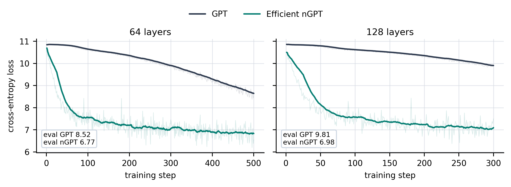

# Efficient nGPT

Efficient nGPT, or enGPT, is a compact research implementation of normalized
GPT in PyTorch. It is nGPT, not a different architecture: the residual updates,
unit-sphere parameter constraints, tangent-gradient projection, and output
parameterization are kept explicit and testable.

The main implementation detail is the carried-radius hidden state. Instead of
materializing every normalized residual state, enGPT stores activations as
`(Y, rho)` and reads the represented state as `Y / rho`. This keeps the nGPT
math intact while moving the implementation closer to GPT-like activation
storage, throughput, and VRAM use. The current code is already near GPT memory
use in the smaller GPU runs, and I am still optimizing the kernels and training
path to close the remaining throughput gap.

The repository includes:

- `EfficientNGPT`, an exact carried-radius nGPT decoder.
- `GPTBaseline`, a pre-LN GPT reference model trained with AdamW.
- `NGPTAdamW`, spherical AdamW with tangent-gradient projection and unit-sphere retraction.
- Health checks, FineWeb tokenization, GPU benchmark scripts, and publication plots.

## Results

The first figure is the most important one to show. On a 10M-token FineWeb GPT-2
token stream, enGPT improves token efficiency; on the current CUDA kernel
benchmark at the same 4-layer, `d=256`, `T=256`, `B=16` shape it measures
`0.91x` GPT forward throughput, `0.82x` train throughput, and `1.00x` peak train
memory.



The depth result is the second figure I would show. Here the point is different:
enGPT naturally handles much deeper stacks. At 64 and 128 layers, the carried
nGPT model remains stable and reaches substantially lower loss than the GPT
baseline under the same small-model depth stress test.



More generated figures are in [assets/figures/gallery](assets/figures/gallery),
including loss against clock time, gradient norm, step time, eval loss, memory,
and throughput tradeoff plots. The JSON reports used for the figures are in
[assets/reports](assets/reports), so the plots can be regenerated rather than
treated as opaque screenshots.

## Install

Use Python 3.9 or newer. Install the PyTorch wheel that matches your machine,
then install this package.

```bash
python -m venv .venv
source .venv/bin/activate
python -m pip install -U pip
```

Choose one PyTorch install:

```bash
# CPU, Apple Silicon MPS, or the default PyPI wheel
python -m pip install torch

# Linux NVIDIA CUDA 12.8 wheel
python -m pip install torch --index-url https://download.pytorch.org/whl/cu128
```

For a different CUDA, ROCm, or platform-specific wheel, use the official PyTorch
selector: https://pytorch.org/get-started/locally/

Install enGPT:

```bash
python -m pip install -e ".[dev,plots,data,server]"
```

Minimal install for library use:

```bash
python -m pip install -e .
```

## Quick Check

```bash
python -c "import engpt, torch; print(engpt.__version__, torch.__version__)"
python examples/quickstart.py --device cpu
python -m pytest -q
engpt-health --device cpu --json
```

If CUDA is available, replace `cpu` with `cuda`. AMD ROCm builds expose the GPU
through PyTorch's `cuda` device type. Apple Silicon uses `mps`.

## Use The Model

```python
import torch
from engpt import EfficientNGPT, ModelConfig, build_ngpt_adamw

cfg = ModelConfig(vocab_size=50257, block_size=256, n_layer=4, n_head=4, n_embd=256)
model = EfficientNGPT(cfg)
opt = build_ngpt_adamw(model, lr=1e-3)

x = torch.randint(0, cfg.vocab_size, (2, cfg.block_size))
y = torch.roll(x, shifts=-1, dims=1)
_, loss = model(x, y)
loss.backward()
opt.step()
```

## Reproduce The Figures

The included reports are enough to regenerate the figures without downloading
data:

```bash
engpt-plot-publication
```

To make a new FineWeb GPT-2 token memmap:

```bash
engpt-tokenize-fineweb \
  --tokens 10000000 \
  --out data/fineweb_gpt2_10m_u16.bin \
  --meta-out data/fineweb_gpt2_10m_meta.json
```

Run a GPU benchmark with recorded gradient norms and wall-clock traces:

```bash
engpt-gpu-train \
  --tokens data/fineweb_gpt2_10m_u16.bin \
  --device cuda --dtype bf16 \
  --steps 300 --warmup-steps 2 \
  --eval-iters 10 --bench-iters 20 \
  --batch-size 16 --seq-len 256 \
  --layers 4 --heads 4 --dim 256 \
  --engpt-checkpoint --record-step-stats \
  --out runs/gpu_report_publication_trace.json
```

Plot any single GPU report:

```bash
engpt-plot-report --report runs/gpu_report_publication_trace.json --out runs/loss.png
```

## Package

Build a wheel and source distribution:

```bash
python -m pip install build
python -m build
python -m pip install --force-reinstall dist/efficient_ngpt-0.1.0-py3-none-any.whl
```

The package has no custom CUDA extension. It depends on `torch>=2.0`, so CPU,
CUDA, MPS, and ROCm compatibility follows the installed PyTorch wheel.

## Notes

The carried state uses an exact gauge rescale to keep deep stacks finite in
BF16. It preserves `Y / rho` while preventing overflow of the raw carried
numerator and radius. This is the small numerical detail that makes the 64 and
128 layer runs stable without changing the represented hidden state.

The present implementation is intentionally plain PyTorch. That makes it easier
to audit and modify, but it leaves performance on the table. The next natural
step is to fuse the carried residual and Q/K normalization paths, with the aim
of making nGPT feel much closer to a normal GPT implementation in both speed and
VRAM requirements.
